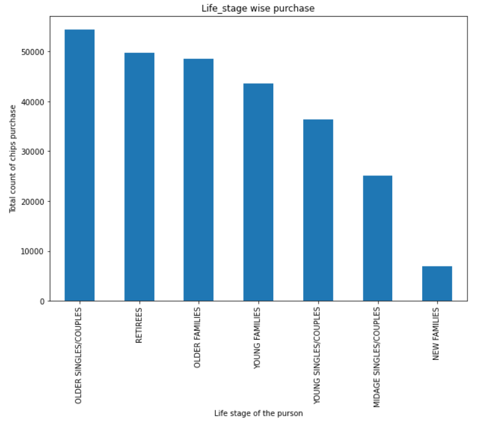
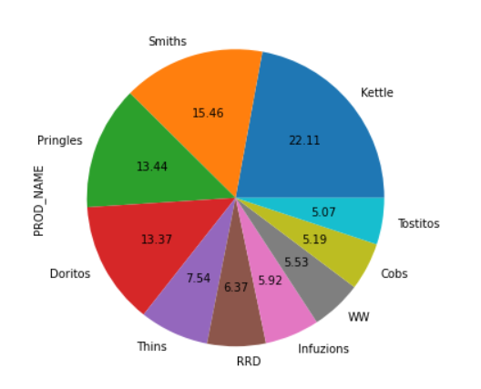
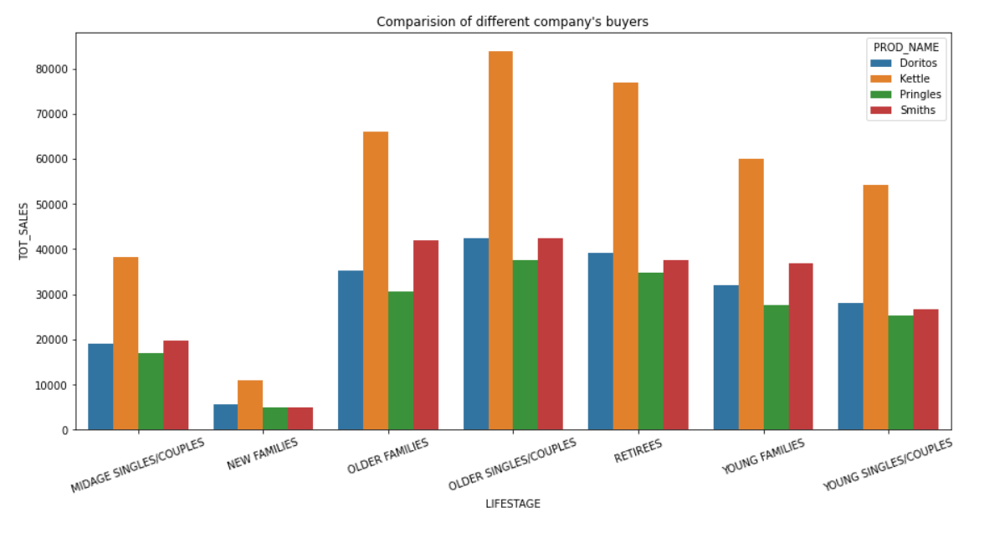

# Data-Analytics-Virtual-Experience-Program
## Data_cleaning_visualizing

### Introduction 

The category manager for chips (The client) wants to better understand the types of customer who purchases chips and there purchasing behaviour within the region.
This project helps the client to find out which segment of customer they should target. 

### Requirement 

* pandas
* numpy
* Matplotlib
* Seaborn

You will also need to have software installed to run and execute a Jupyter Notebook

If you do not have Python installed yet, it is highly recommended that you install the Anaconda distribution of Python, 
which already has the above packages and more included. Make sure that you select the Python 2.7 installer and not the Python 3.x installer.

### Code
Template code is provided in the `Task_1-Data_cleaning_visualizing-checkpoint.ipynb ` jupyter notebook file. 
You will also be required to use the `QVI_purchase_behaviour.csv` and `QVI_transaction_data.xlsx` dataset files to complete your work. 

### Challenges 
Column spliting was a challenging task for this data set. As the company name was including the product type and size. 

### Result 

<strong> Older people contributes more to the chip's sales then younger people. </strong>

<strong> Top three sales from `Kettle`,`Smiths`,`Pringles`</strong>

<strong> Life stage of the customer v/s Total Sale by company's name
 
  
### Conclusion

we should target Older Single/couple, Retairees and Older people than young people. Famous product company for chips is Kettle, smiths, Doritos, Pringle. According to data, December and march are having highest sales so we should be prepare for these months.
 
